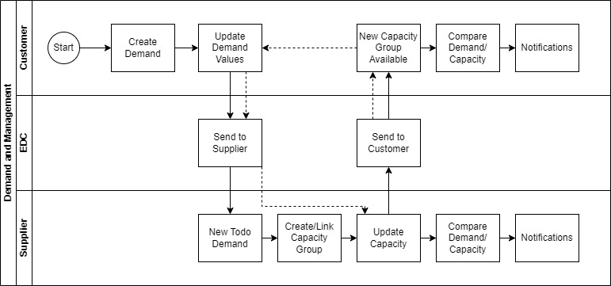
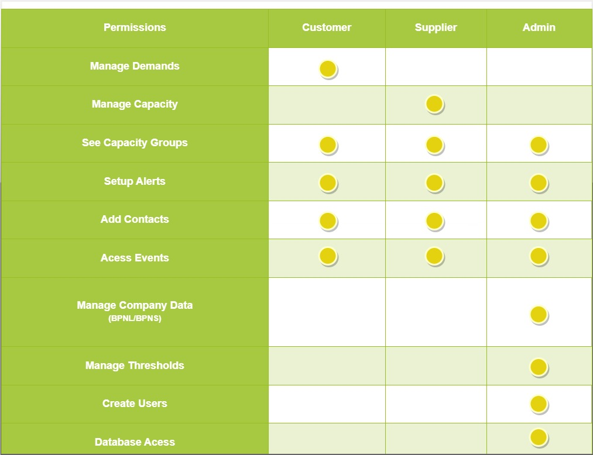

Table of content:
- [Supply and Demand Application](#supply-and-demand-application)
  - [Key Components:](#key-components)
    - [Collaborative Process](#collaborative-process)
    - [Transparency and Visibility](#transparency-and-visibility)
    - [Early Detection and Mitigation](#early-detection-and-mitigation)
    - [Planning and Optimization](#planning-and-optimization)
  - [Application Workflow](#application-workflow)
    - [Demand Creation](#demand-creation)
    - [Demand Update and Verification](#demand-update-and-verification)
    - [Sharing with Suppliers](#sharing-with-suppliers)
    - [Capacity Group Management](#capacity-group-management)
    - [Capacity Allocation](#capacity-allocation)
    - [Visibility and Monitoring](#visibility-and-monitoring)
    - [Delta Analysis and Threshold Setting](#delta-analysis-and-threshold-setting)
  - [Workflow diagram](#workflow-diagram)
  - [Prerequisites](#prerequisites)
  - [How to run](#how-to-run)
- [Highlevel Architecture Diagram](#highlevel-architecture-diagram)
- [Roles And Access](#roles-and-access)
- [NOTICE](#notice)

# Supply and Demand Application

## Key Components:
Data Exchange Platform: The application serves as a central hub where partners can securely share demand and capacity data. This platform ensures that all stakeholders have access to real-time information, enabling them to make informed decisions and respond promptly to changes in demand or capacity.

- ### Collaborative Process
    Demand and Capacity Management (DCM) is based on a collaborative process, allowing partners to work together to optimize planning, reduce costs, and improve supply chain efficiency. By sharing data and insights, partners can anticipate potential issues, identify bottlenecks, and proactively address them before they impact operations.

- ### Transparency and Visibility
    The application provides partners with a transparent view of demand and capacity across the entire supply chain. This visibility allows stakeholders to monitor fluctuations, identify trends, and assess the impact of external factors on supply chain operations.

- ### Early Detection and Mitigation
    Through real-time monitoring and analysis, the application enables early detection of potential problems, such as capacity constraints or demand surges. By identifying issues at an early stage, partners can take proactive measures to mitigate risks and avoid disruptions in supply chain operations.

- ### Planning and Optimization 
    By leveraging data-driven insights, partners can optimize planning and resource allocation to meet demand efficiently. The application helps identify opportunities for improving resource utilization, reducing waste, and enhancing overall operational efficiency.

## Application Workflow
The Demand and Capacity Management application streamlines the exchange of demand and capacity data within the automotive supply chain, enabling efficient collaboration and proactive decision-making. Here's how the application workflow unfolds:

- **Demand Creation:** The process begins when a customer creates a demand, specifying the required quantity of a particular product or component.

- **Demand Update and Verification:** Once the demand is created, its values should be updated to reflect necessity of the customer based on production schedules. These updates must be verified to ensure accuracy and consistency before being transmitted to the *Eclipse Dataspace Connector* (EDC) for dissemination.

- **Sharing with Suppliers:** The updated demand data is shared with suppliers through the EDC, providing them with visibility into customer requirements and market demand trends. Suppliers can access this information in their local application, allowing them to review demand forecasts, analyze consumption patterns, and anticipate future orders.

- **Capacity Group Management:** Upon receiving the demand data, suppliers have the option to either add it to an existing capacity group or create a new one. A capacity group represents a collection of resources, facilities, or production lines capable of fulfilling specific demand requirements. 

- **Capacity Allocation:** Once a capacity group is established, suppliers allocate resources to meet the demand forecasted for that group. This involves assigning production quotas, scheduling manufacturing runs, and coordinating logistics to ensure timely delivery of products to customers.

- **Visibility and Monitoring:** Both customers and suppliers have access to real-time dashboards and reports that provide visibility into demand and capacity metrics. These metrics include demand category requests, actual capacity, maximum capacity and a delta in a per week basis.By monitoring these metrics, they can identify potential bottlenecks, anticipate supply chain disruptions, and take proactive measures to address them.

- **Delta Analysis and Threshold Setting:** As demand and capacity data are updated, the application calculates deltas to measure changes in supply-demand dynamics.Suppliers use this information to identify potential bottlenecks, prioritize production schedules, and allocate resources efficiently. Additionally, admins can set thresholds and users can trigger alerts when certain metrics exceed predefined limits, enabling timely intervention and risk mitigation.

### Workflow diagram

## Roles And Access 
Within the Application, distinct roles and access levels are assigned to users, enabling effective management and control over the application's functionalities.

**User:** As a user, individuals typically interact with the application to create demands, update demand values, and verify their accuracy. Users primarily contribute to the demand side of the supply chain by providing input on their requirements and preferences.

**Supplier:** Suppliers play a crucial role in the supply chain by fulfilling demand requirements and allocating resources accordingly. In the application, suppliers have access to features for managing capacity groups, assigning resources, and monitoring production. They utilize the platform to optimize resource utilization, prioritize production runs, and ensure delivery of products to customers.

**Admin:** Admins are responsible for overseeing the overall operation of the application and ensuring compliance with organizational policies and procedures. They have access to administrative tools and controls for configuring system settings, managing user roles and permissions, and setting up thresholds.

## NOTICE

This work is licensed under the [Apache-2.0](https://www.apache.org/licenses/LICENSE-2.0).

- SPDX-License-Identifier: Apache-2.0
- Licence Path: https://creativecommons.org/licenses/by/4.0/legalcode
- Copyright (c) 2022,2023 Contributors to the Eclipse Foundation
- Copyright (c) 2022, 2023 Bayerische Motoren Werke Aktiengesellschaft (BMW AG)
- Source URL: https://github.com/eclipse-tractusx/vas-country-risk-backend