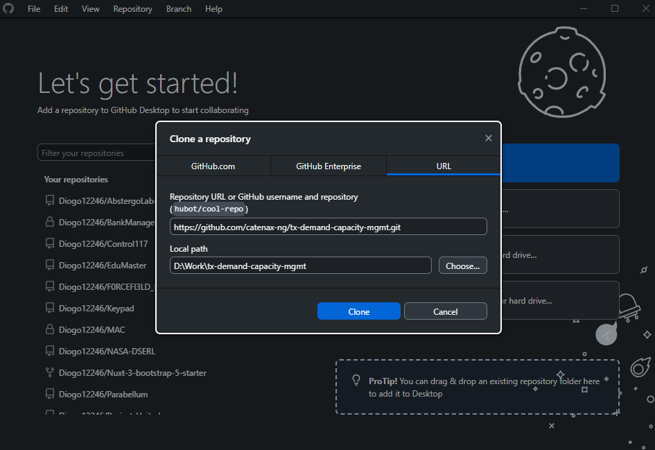
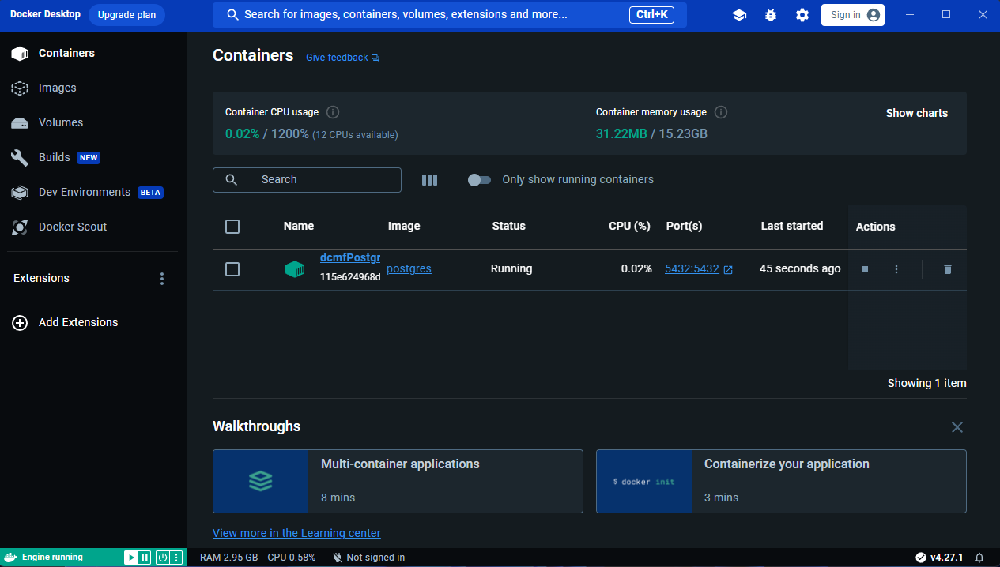
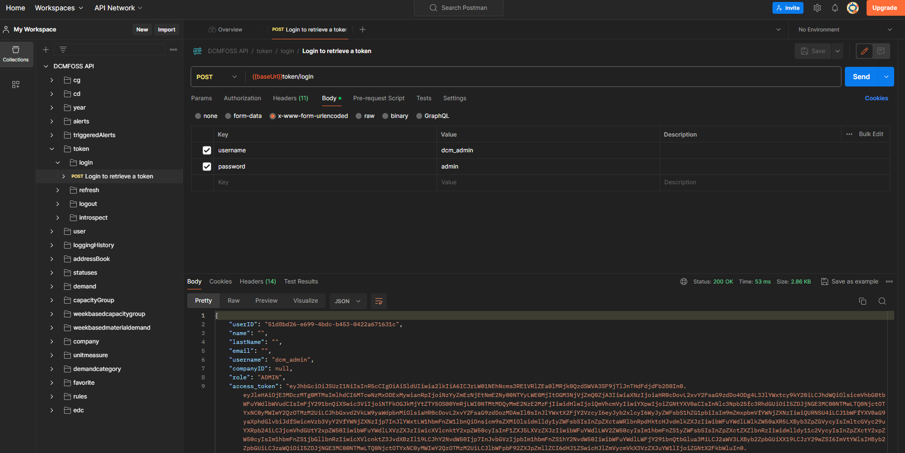
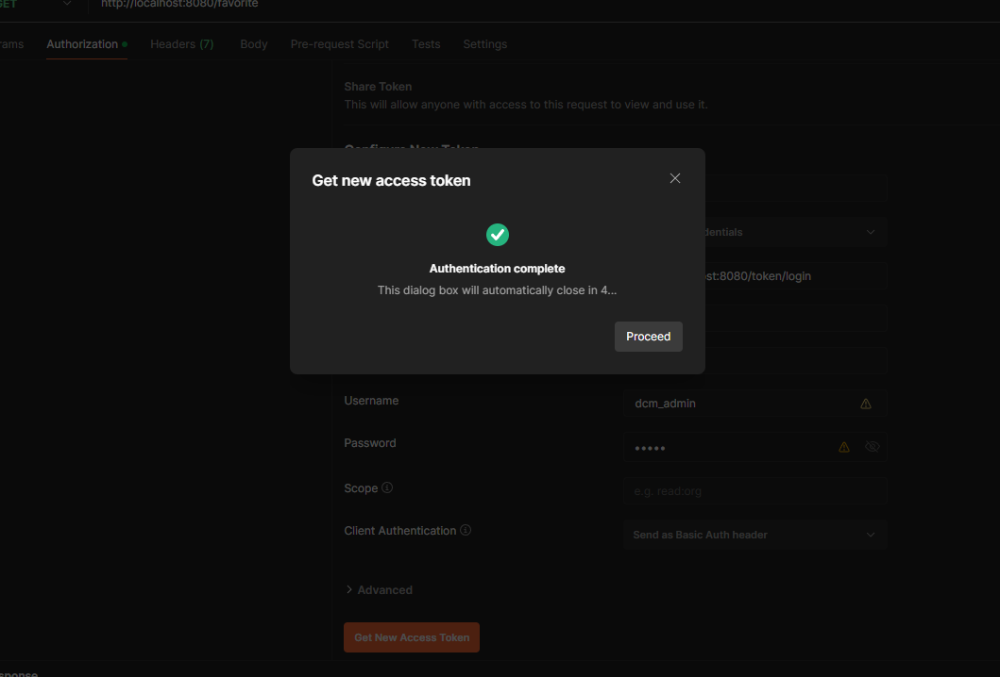
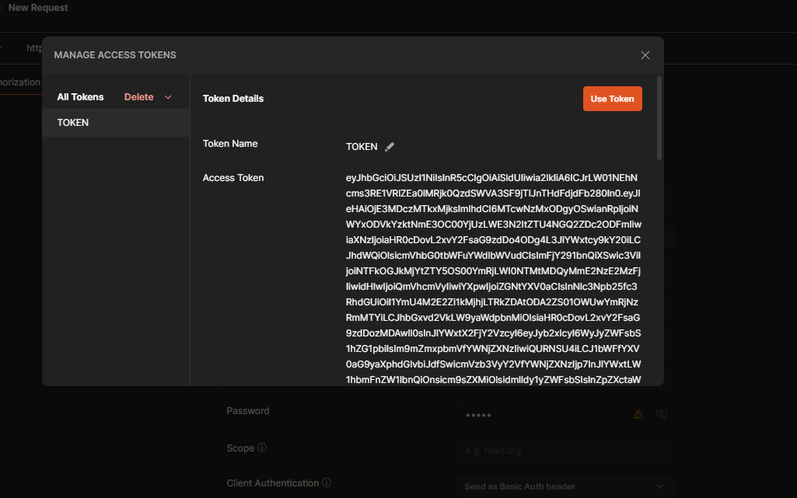

# DCMFOSS local install for dev

## Preface:
This guide assumes updated windows with docker running, but will try to provide general instructions.

## Guide:
Let's begin local development install!

- ### Cloning the repository
    Clone the repository from the url below

    https://github.com/catenax-ng/tx-demand-capacity-mgmt.git
    
    

- ### Open in your own IDE of choice
    Boot your IDE of choice and open the backend repo,
    add the specification as a module of the backend project.
    
    

    

  it is normal for startup to have errors, let your IDE finish configuring and download dependencies.

  go ahead and run a maven clean and install on the specification cycle.
  if it fails saying you don't have a JDK, choose JDK17 of your choice.

- ### Docker desktop

    Before you run the project we need to setup Postgres and Keycloak.
    Let's begin with installing docker(if you are running windows make sure to use WSL2).
    After installing docker on your machine lets install postgres.
    if you get an error of Hyper V make sure **virtualization is enabled on your motherboard
    and if you're on windows, enable Hyper-V feature-**
    if you get an error of wsl update not supported
    download and install 

    https://wslstorestorage.blob.core.windows.net/wslblob/wsl_update_x64.msi 
    
    open a powershell and type 

    **wsl --set-default-version 2**
    
    then try again

    

- ### Running containers

  with docker running open a poweshell type

  **docker pull postgres**

  this will download the postgres image, then you need to configure postgres

  **docker run -d --name dcmfPostgres -p 5432:5432 -e POSTGRES_PASSWORD=dcm -e POSTGRES_USER=dcm postgres**

  choose your own credentials of course, please **do not** use credentails shown on the guide.
  now connect to postgres DB either through your IDE or PGADMIN4

  

  

- ### Running project first time for init configs
  execute all flyaway scripts on the postgres dcm schema.
  and create a keycloak schema (for later use by keycloak)
  . Run the project. 
  and
  when you see "Completed initialization in 1ms" stop the project. 

- ### Running Keycloak
  open a new cmd file and run 

  **docker run -p 8888:8080 -e KEYCLOAK_ADMIN=YourAdminName -e KEYCLOAK_ADMIN_PASSWORD=YourAdminPassword quay.io/keycloak/keycloak:23.0.6 start-dev**

  next go to docker and follow the link on the keycloak container. 

  login with admin credentials, under realms, click create new realm
  import the realm-export.json on the keycloak folder.

  
  
  modify users to you heart's content(under the users tabs, credentials for them, assing roles, etc). 

  **Remember you need to have a user role on all users, it can be ADMIN, CUSTOMER, SUPPLIER**
  failing to have one of these roles won't let the user login in the app.

  

- ### Fetching the keycloak client credential
  before booting the project again navigate to dcmauth client on keycloak panel and copy the client secret under credentials.
  open your application.yaml and place it on the dcmsecr section.
  
  after that run the project and in postman you should be able to login on the token endpoint with the credentials you modified on keycloak!

  

- ### Configure postman collection requests!
  for the other requests on postman you need to alter the authorization tab.
  check the config on the images provided.

  

  

  

  

- ### Run the front-end
  when postman is working, you need to open the front end on your IDE of choice and run on a terminal inside the front end folder, make sure you have NodeJS installed on your machine.

  **yarn install** 

  **yarn start**

  the app will be booted on localhost:3000

  
## NOTICE

This work is licensed under the [Apache-2.0](https://www.apache.org/licenses/LICENSE-2.0).

- SPDX-License-Identifier: Apache-2.0
- Licence Path: https://creativecommons.org/licenses/by/4.0/legalcode
- Copyright (c) 2022,2023 Contributors to the Eclipse Foundation
- Copyright (c) 2022, 2023 Bayerische Motoren Werke Aktiengesellschaft (BMW AG)
- Source URL: https://github.com/eclipse-tractusx/vas-country-risk-backend