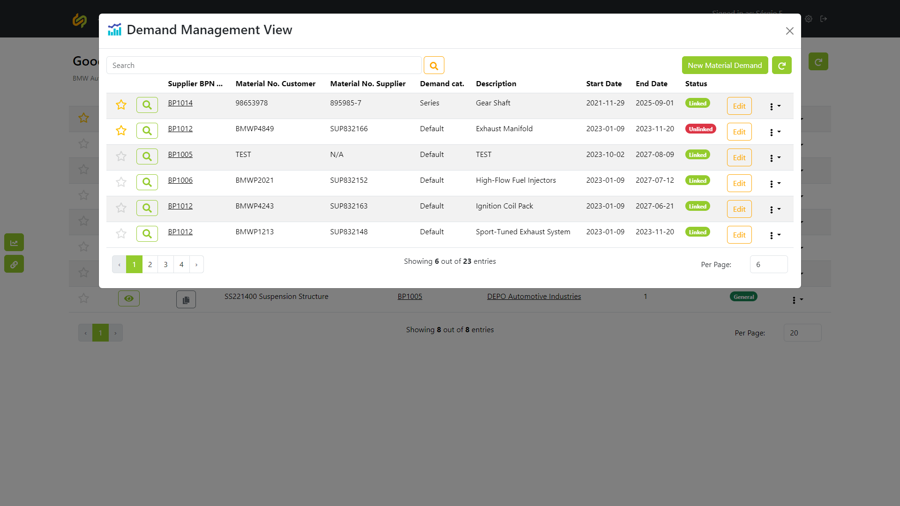

# User Flow

## Customer

- **Create Demand:** 
    1. Access the application dashboard.

    2. Navigate to the "Demand Management" section.

    3. Click on the "Create New Demand" button.
    4. Fill in the required details such as product type, quantity, delivery date, etc.

    5. After that is done, acess the newly created demand and updated its values, by opening its overview and clicking on Edit.
    6. Submit the demand for processing.
- **Update Values:** 
    1. Access the application dashboard.
    2. Go to the "Demand Management" section.
    3. Locate the previously created demand.
    4. Click on the demand to view its details.
    5. Make necessary updates to the demand values such as quantity, delivery date, etc.
    6. Verify the accuracy of the updated values.
    7. Save or submit the changes as required.

## Supplier

- **Manage Capacity Groups:** 
    1. Access the application dashboard.
    2. Navigate to the "Capacity Management" section.
    3. View existing capacity groups or create a new one if necessary.
    4. Assign resources, facilities, or production lines to the capacity group.
    5. Set production quotas and scheduling parameters for the assigned resources.

- **Allocate Resources:** 
    1. Access the application dashboard.
    2. Go to the "Capacity Management" section.
    3. Select a specific capacity group to manage.
    4. Allocate resources based on demand forecasts and production requirements.
    5. Adjust resource allocations as needed to optimize production efficiency.

## Admin

- **Manage User Roles and Permissions:** 
    1. Access the application admin panel.
    2. Navigate to the "User Management" section.
    3. View existing user roles and permissions.
    4. C
